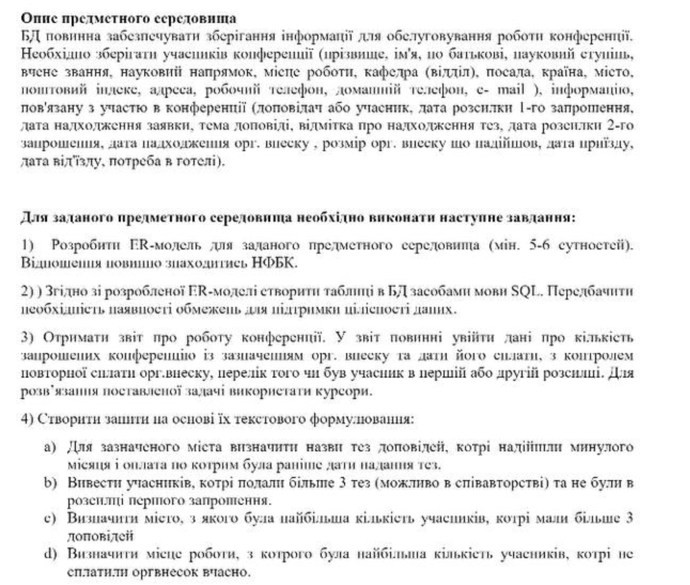
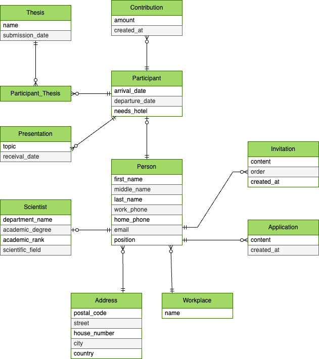

# Preparation for the database engineering exam

## Sql scripts
- [db schema](./src/db-schema.sql)
- [data](./src/data.sql)
- [conference report](./src/conference-report.sql)
- [queries](./src/queries.sql)

## Task

## ER-diagram

