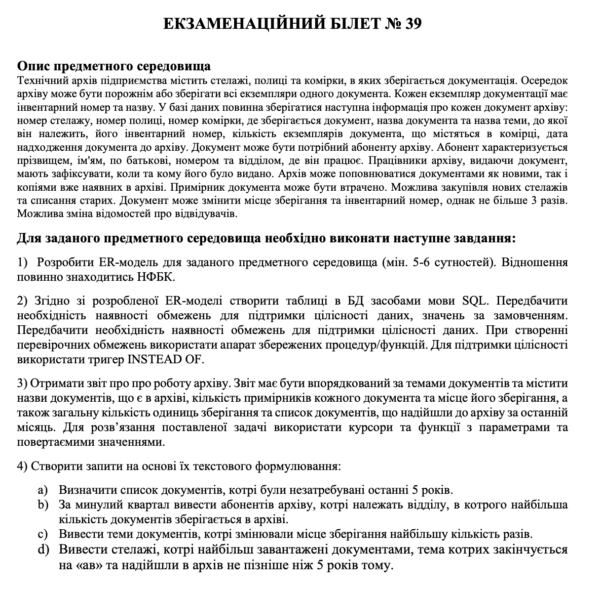
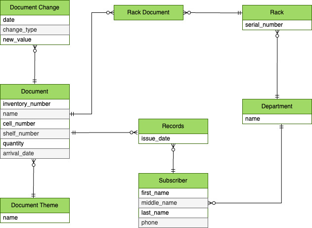

# Variant 39

## Sql scripts
- [db schema](./db-schema.sql)
- [data](./data.sql)
- [report cursor](./report-cursor.sql)
- [trigger fns](./trigger-fns.sql)
- [queries](./queries.sql)

## Task

## ER-diagram

